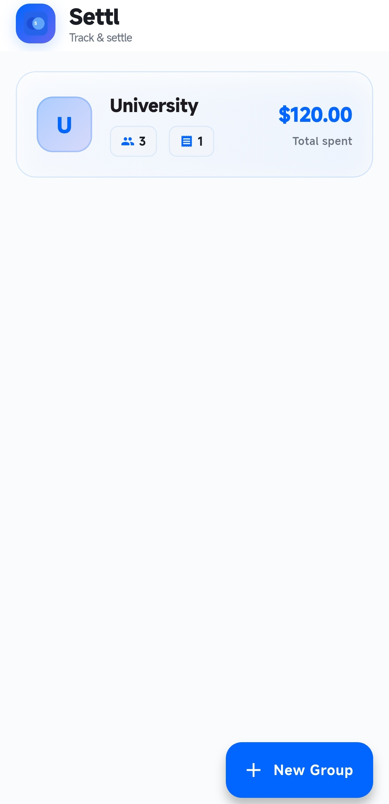
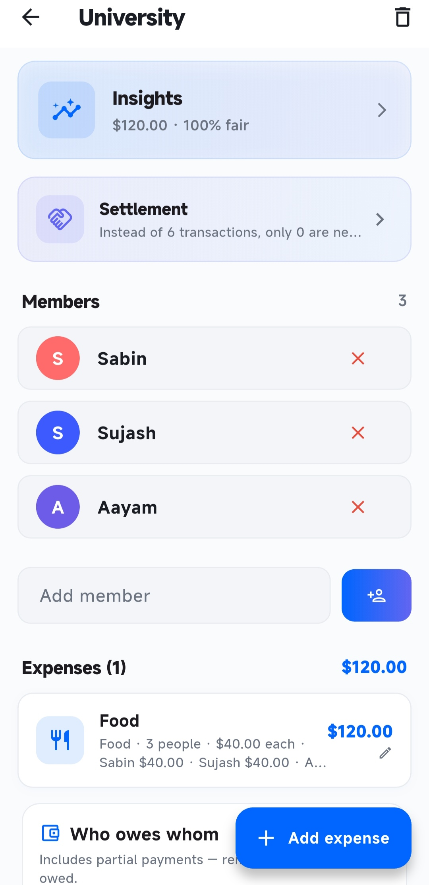
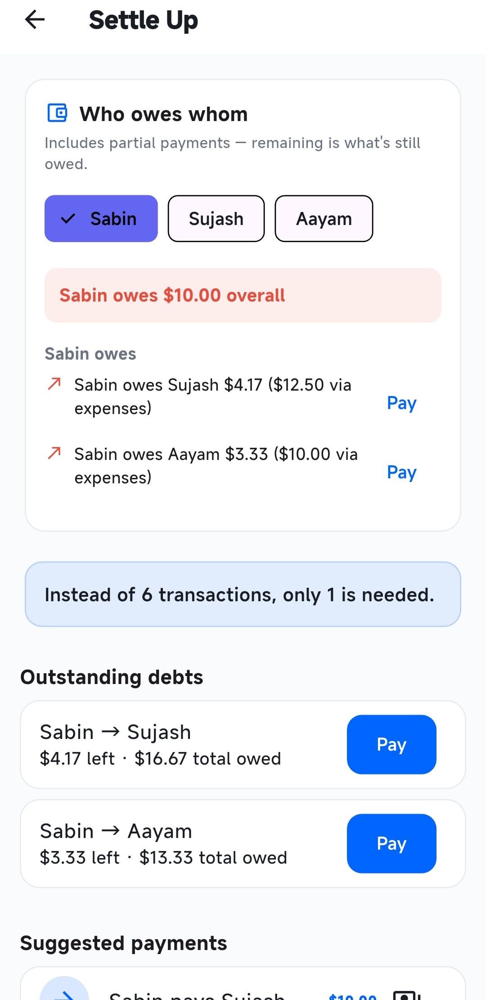

# 💙 Settl

A modern Flutter app for tracking shared expenses and settling debts within groups. Ideal for roommates, trips, events, and friends splitting bills.

## ✨ Features

- Create and manage expense groups
- Add and split expenses between members
- Smart debt settlement calculations
- Spending insights and analytics
- Category-based expense tracking
- PDF report export
- Offline local storage with Hive
- Clean and intuitive UI

## 📱 Screenshots

  
  
  

